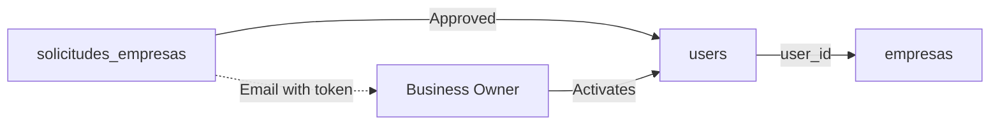

## Overview

BeanQuick implements a secure three-stage business registration process that ensures quality control through admin approval before vendors can start selling on the platform.

## Registration Workflow

The business onboarding process consists of three distinct stages:

1. **Initial Application** - Business submits registration request
2. **Admin Review** - Platform admin approves or rejects application
3. **Account Activation** - Approved business creates login credentials

### Stage 1: Initial Application

Businesses submit their information through a public endpoint without authentication.

**Endpoint:** `POST /api/solicitud-empresa`

**Required Fields:**
- `nombre` (string, max 255) - Business name
- `correo` (email, unique) - Business email
- `nit` (string, optional) - Tax identification number
- `telefono` (string, optional) - Phone number
- `direccion` (string, optional) - Physical address
- `descripcion` (text, optional) - Business description
- `logo` (image file, max 2MB) - Business logo
- `foto_local` (image file, max 4MB) - Store photo

**Implementation:**
```php
// SolicitudEmpresaController.php:16
public function store(Request $request): JsonResponse
{
    $request->validate([
        'nombre' => 'required|string|max:255',
        'correo' => 'required|email|unique:solicitudes_empresas,correo',
        // ... other validations
    ]);

    $data = $request->except(['logo', 'foto_local']);

    // Store images in temporary location
    if ($request->hasFile('logo')) {
        $data['logo'] = $request->file('logo')->store('solicitudes/logos', 'public');
    }
    
    if ($request->hasFile('foto_local')) {
        $data['foto_local'] = $request->file('foto_local')->store('solicitudes/locales', 'public');
    }

    $solicitud = SolicitudEmpresa::create($data);
    // Created with estado='pendiente' by default
}
```

**Database Schema:**
```sql
CREATE TABLE solicitudes_empresas (
    id BIGINT PRIMARY KEY AUTO_INCREMENT,
    nombre VARCHAR(255) NOT NULL,
    correo VARCHAR(255) UNIQUE NOT NULL,
    nit VARCHAR(255) NULL,
    telefono VARCHAR(255) NULL,
    direccion VARCHAR(255) NULL,
    descripcion TEXT NULL,
    logo VARCHAR(255) NULL,
    foto_local VARCHAR(255) NULL,
    estado ENUM('pendiente', 'aprobado', 'rechazado', 'completada') DEFAULT 'pendiente',
    token VARCHAR(255) NULL,
    created_at TIMESTAMP,
    updated_at TIMESTAMP
);
```

### Stage 2: Admin Approval

Platform administrators review pending applications and can approve or reject them.

**Approval Endpoint:** `POST /api/admin/aprobar/{id}`

**Approval Process:**
```php
// AdminController.php:43
public function aprobar($id): JsonResponse
{
    $solicitud = SolicitudEmpresa::findOrFail($id);

    // Generate secure 60-character activation token
    $token = Str::random(60);

    $solicitud->update([
        'estado' => 'aprobado',
        'token'  => $token 
    ]);

    // Create activation link for frontend
    $link = "http://localhost:5173/empresa/activar/" . $token;

    // Send activation email
    Mail::to($solicitud->correo)->send(new ActivacionEmpresaMail($solicitud, $link));
}
```

**Rejection Endpoint:** `POST /api/admin/rechazar/{id}`

```php
// AdminController.php:80
public function rechazar($id): JsonResponse
{
    $solicitud = SolicitudEmpresa::findOrFail($id);
    $solicitud->estado = 'rechazado';
    $solicitud->save();
}
```

### Stage 3: Account Activation

Approved businesses receive an email with a unique activation link containing a secure token.

**Token Validation:** `GET /api/empresa/validar-token/{token}`

```php
// EmpresaActivacionController.php:20
public function validarToken($token): JsonResponse
{
    $solicitud = SolicitudEmpresa::where('token', $token)
        ->where('estado', 'aprobado')
        ->first();

    if (!$solicitud) {
        return response()->json([
            'message' => 'El enlace de activación no es válido o ya fue usado.'
        ], 404);
    }

    return response()->json([
        'status' => 'success',
        'solicitud' => $solicitud
    ]);
}
```

**Account Creation:** `POST /api/empresa/activar/{token}`

The business owner sets their password and the system creates:
- User account with role 'empresa'
- Business profile in `empresas` table
- Moves images from temporary to permanent storage

```php
// EmpresaActivacionController.php:41
public function store(Request $request, $token): JsonResponse
{
    $request->validate([
        'password' => 'required|confirmed|min:8',
    ]);

    DB::beginTransaction();

    try {
        // 1. Create user account
        $user = User::create([
            'name' => $solicitud->nombre,
            'email' => $solicitud->correo,
            'password' => Hash::make($request->password),
            'rol' => 'empresa',
        ]);

        // 2. Move logo from temp to permanent storage
        if ($solicitud->logo && Storage::disk('public')->exists($solicitud->logo)) {
            $logoFileName = basename($solicitud->logo);
            $newLogoPath = 'empresas/logos/' . $logoFileName;
            Storage::disk('public')->copy($solicitud->logo, $newLogoPath);
            $empresaData['logo'] = $newLogoPath;
        }

        // 3. Create business profile
        $empresa = Empresa::create([
            'user_id' => $user->id,
            'nombre' => $solicitud->nombre,
            'nit' => $solicitud->nit,
            'direccion' => $solicitud->direccion,
            'telefono' => $solicitud->telefono,
            'descripcion' => $solicitud->descripcion,
            'logo' => $newLogoPath,
            'foto_local' => $newFotoPath,
        ]);

        // 4. Update application status
        $solicitud->update([
            'estado' => 'completada',
            'token' => null,
        ]);

        // 5. Clean up temporary files
        Storage::disk('public')->delete($solicitud->logo);
        Storage::disk('public')->delete($solicitud->foto_local);

        DB::commit();
    } catch (\Exception $e) {
        DB::rollBack();
        throw $e;
    }
}
```

## Database Relationships



### Tables Involved

**solicitudes_empresas**
- Stores initial business applications
- Contains temporary image paths
- Tracks approval status

**users**
- Created after activation
- rol = 'empresa'
- Links to business profile

**empresas**
- Business profile data
- Contains permanent image paths
- Foreign key to users table

## Security Features

1. **Unique Email Validation** - Prevents duplicate applications
2. **Secure Token Generation** - 60-character random string
3. **One-time Activation** - Token is nullified after use
4. **Admin Approval Gate** - All businesses vetted before activation
5. **Transaction Safety** - Database rollback on activation failure

## Image Handling

**Storage Strategy:**
- **Temporary:** `storage/solicitudes/logos/` and `storage/solicitudes/locales/`
- **Permanent:** `storage/empresas/logos/` and `storage/empresas/locales/`

Images are copied (not moved) during activation to ensure data integrity, then temporary files are deleted after successful activation.

## API Response Examples

**Successful Application:**
```json
{
  "status": "success",
  "message": "Tu solicitud fue enviada correctamente. Nuestro equipo la revisará pronto.",
  "solicitud_id": 12
}
```

**Successful Activation:**
```json
{
  "status": "success",
  "message": "Cuenta creada exitosamente. Ya puedes iniciar sesión.",
  "user": {
    "id": 5,
    "name": "Café Luna",
    "email": "[email protected]",
    "rol": "empresa"
  }
}
```

## Common Use Cases

### Check Pending Applications
```http
GET /api/admin/solicitudes
Authorization: Bearer {admin_token}
```

### Approve and Send Activation Email
```http
POST /api/admin/aprobar/12
Authorization: Bearer {admin_token}
```

### Business Activates Account
```http
POST /api/empresa/activar/abc123...
Content-Type: application/json

{
  "password": "securePassword123",
  "password_confirmation": "securePassword123"
}
```