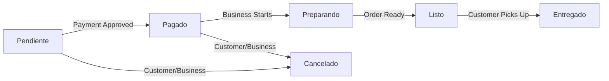

## Overview

BeanQuick implements a comprehensive order management system that handles the complete lifecycle of customer purchases, from cart checkout to order fulfillment. Orders are scoped per business and include payment validation, stock management, and status tracking.

## Order Model Structure

### Database Schema

**pedidos table:**
```sql
CREATE TABLE pedidos (
    id BIGINT PRIMARY KEY AUTO_INCREMENT,
    user_id BIGINT NOT NULL,
    empresa_id BIGINT NOT NULL,
    total DECIMAL(10,2) NOT NULL,
    hora_recogida TIME NULL,
    estado ENUM('Pendiente', 'Preparando', 'Listo', 'Entregado', 'Cancelado') DEFAULT 'Pendiente',
    estado_pago ENUM('pendiente', 'aprobado', 'rechazado', 'reembolsado') DEFAULT 'pendiente',
    created_at TIMESTAMP,
    updated_at TIMESTAMP,
    FOREIGN KEY (user_id) REFERENCES users(id) ON DELETE CASCADE,
    FOREIGN KEY (empresa_id) REFERENCES empresas(id) ON DELETE CASCADE
);
```

**pedido_productos pivot table:**
```sql
CREATE TABLE pedido_productos (
    id BIGINT PRIMARY KEY AUTO_INCREMENT,
    pedido_id BIGINT NOT NULL,
    producto_id BIGINT NOT NULL,
    cantidad INT NOT NULL,
    precio_unitario DECIMAL(10,2) NOT NULL,
    created_at TIMESTAMP,
    updated_at TIMESTAMP,
    FOREIGN KEY (pedido_id) REFERENCES pedidos(id) ON DELETE CASCADE,
    FOREIGN KEY (producto_id) REFERENCES productos(id) ON DELETE CASCADE
);
```

### Model Configuration

```php
// Pedido.php:12
protected $fillable = [
    'user_id',
    'empresa_id',
    'estado',        // Order fulfillment status
    'estado_pago',   // Payment status
    'hora_recogida', // Pickup time
    'total'
];

protected $casts = [
    'total' => 'float',
    'hora_recogida' => 'datetime:H:i',
    'created_at' => 'datetime:d/m/Y H:i',
];
```

## Order Lifecycle

Orders progress through distinct states:

### Order States (estado)

1. **Pendiente** - Order created, awaiting payment
2. **Pagado** - Payment approved, business can start preparing
3. **Preparando** - Business is preparing the order
4. **Listo** - Order ready for pickup
5. **Entregado** - Customer has picked up order
6. **Cancelado** - Order cancelled (before preparation)

### Payment States (estado_pago)

1. **pendiente** - Payment not yet processed
2. **aprobado** - Payment confirmed by Mercado Pago
3. **rechazado** - Payment declined
4. **reembolsado** - Payment refunded

## Creating Orders

### Order Creation Flow

Orders are created from cart items for a specific business.

**Endpoint:** `POST /api/cliente/pedidos`

**Request:**
```json
{
  "empresa_id": 2,
  "hora_recogida": "14:30"
}
```

**Implementation:**
```php
// PedidoController.php:34
public function store(Request $request): JsonResponse
{
    $user = Auth::user();

    // Prevent duplicate pending orders
    $pedidoExistente = Pedido::where('user_id', $user->id)
        ->where('estado', 'Pendiente')
        ->where('estado_pago', 'pendiente')
        ->first();
    
    if ($pedidoExistente) {
        return response()->json([
            'message' => 'Ya tienes un pedido pendiente de pago.',
            'pedido' => $pedidoExistente->load('productos')
        ], 200);
    }
      
    $request->validate([
        'empresa_id'    => 'required|exists:empresas,id',
        'hora_recogida' => 'required|date_format:H:i'
    ]);

    return \DB::transaction(function () use ($user, $request) {
        
        $carrito = Carrito::where('user_id', $user->id)
            ->with('productos')
            ->first();

        if (!$carrito || $carrito->productos->isEmpty()) {
            return response()->json(['message' => 'Tu carrito está vacío.'], 400);
        }

        // Filter cart items for this business
        $productosTienda = $carrito->productos->filter(function ($producto) use ($request) {
            return (int)$producto->empresa_id === (int)$request->empresa_id;
        });

        if ($productosTienda->isEmpty()) {
            return response()->json([
                'message' => 'No hay productos de esta empresa en tu carrito.'
            ], 422);
        }

        // Validate stock (but don't deduct yet)
        foreach ($productosTienda as $producto) {
            $cantidadPedida = $producto->pivot->cantidad ?? 1;

            if ($producto->stock < $cantidadPedida) {
                return response()->json([
                    'message' => "Stock insuficiente para: {$producto->nombre}. Disponible: {$producto->stock}"
                ], 422);
            }
        }

        // Calculate total
        $total = 0;
        foreach ($productosTienda as $producto) {
            $cantidad = $producto->pivot->cantidad ?? 1;
            $precio   = $producto->precio ?? 0;
            $total   += $precio * $cantidad;
        }

        // Create order (PENDING PAYMENT)
        $pedido = Pedido::create([
            'empresa_id'    => $request->empresa_id,
            'user_id'       => $user->id,
            'estado'        => 'Pendiente',
            'hora_recogida' => $request->hora_recogida,
            'total'         => $total,
            'estado_pago'   => 'pendiente'
        ]);

        // Register products (WITHOUT touching stock)
        foreach ($productosTienda as $producto) {
            PedidoProducto::create([
                'pedido_id'       => $pedido->id,
                'producto_id'     => $producto->id,
                'cantidad'        => $producto->pivot->cantidad ?? 1,
                'precio_unitario' => $producto->precio ?? 0,
            ]);
        }

        return response()->json([
            'message' => 'Pedido generado pendiente de pago.',
            'pedido'  => $pedido->load('productos')
        ], 201);
    });
}
```

### Stock Management Strategy

BeanQuick uses a **payment-first** stock deduction strategy:

1. **Order Creation** - Validates stock availability but does NOT deduct
2. **Payment Approval** - Stock is deducted when payment confirmed
3. **Order Cancellation** - Stock is restored if order cancelled after payment

This prevents stock reservation issues and ensures accurate inventory.

## Pickup Time Scheduling

Customers specify a pickup time when creating orders:

```json
{
  "hora_recogida": "14:30"  // 24-hour format HH:mm
}
```

**Validation:**
- Required field
- Format: `H:i` (e.g., "09:00", "14:30", "18:45")
- Stored as TIME type in database
- Displayed as formatted time in responses

**Use Cases:**
- Customer schedules convenient pickup time
- Business knows when to have order ready
- Prevents customer wait times

## Customer Order Views

### List Customer Orders

**Endpoint:** `GET /api/cliente/mis-pedidos`

```php
// PedidoController.php:128
public function indexCliente(): JsonResponse
{
    $pedidos = Pedido::where('user_id', Auth::id())
        ->with(['empresa', 'productos'])
        ->orderBy('created_at', 'desc')
        ->get();

    return response()->json($pedidos);
}
```

**Response:**
```json
[
  {
    "id": 15,
    "user_id": 3,
    "empresa_id": 2,
    "total": 18.50,
    "hora_recogida": "14:30",
    "estado": "Listo",
    "estado_pago": "aprobado",
    "created_at": "05/03/2026 10:23",
    "empresa": {
      "id": 2,
      "nombre": "Café Luna",
      "direccion": "123 Main St"
    },
    "productos": [
      {
        "id": 5,
        "nombre": "Cappuccino",
        "pivot": {
          "cantidad": 2,
          "precio_unitario": 4.50
        }
      }
    ]
  }
]
```

### Cancel Order

**Endpoint:** `POST /api/cliente/pedidos/{id}/cancelar`

```php
// PedidoController.php:163
public function cancelar($id): JsonResponse
{
    $user = Auth::user();
    $pedido = Pedido::where('id', $id)
        ->where('user_id', $user->id)
        ->with('productos')
        ->first();

    if (!$pedido) {
        return response()->json(['message' => 'Pedido no encontrado'], 404);
    }

    // Can only cancel pending orders
    if (strtolower($pedido->estado) !== 'pendiente') {
        return response()->json([
            'message' => 'No puedes cancelar un pedido ' . $pedido->estado
        ], 400);
    }

    \DB::transaction(function () use ($pedido) {
        
        // Restore stock only if already paid
        if ($pedido->estado_pago === 'aprobado') {
            foreach ($pedido->productos as $producto) {
                $producto->increment('stock', $producto->pivot->cantidad);
            }
        }
        
        $pedido->update([
            'estado' => 'Cancelado',
            'estado_pago' => 'rechazado'
        ]);
    });

    return response()->json(['message' => 'Pedido cancelado y stock devuelto']);
}
```

## Business Order Views

### List Business Orders

Businesses see only paid orders ready for fulfillment.

**Endpoint:** `GET /api/empresa/pedidos`

```php
// PedidoController.php:141
public function indexEmpresa(): JsonResponse
{
    $user = Auth::user();
    $empresa = Empresa::where('user_id', $user->id)->first();

    if (!$empresa) {
        return response()->json([
            'message' => 'No tienes empresa asociada.'
        ], 404);
    }

    // Only show approved payments
    $pedidos = Pedido::where('empresa_id', $empresa->id)
        ->where('estado_pago', 'aprobado')
        ->with(['productos', 'cliente'])
        ->orderBy('created_at', 'asc')
        ->get();

    return response()->json($pedidos);
}
```

### Update Order Status

Businesses can update order fulfillment status.

**Endpoint:** `PATCH /api/empresa/pedidos/{id}/estado`

**Request:**
```json
{
  "estado": "Preparando"
}
```

**Allowed Values:**
- `Preparando` - Business started preparing
- `Listo` - Order ready for pickup
- `Entregado` - Customer picked up order
- `Cancelado` - Business cancelled order

```php
// PedidoController.php:203
public function actualizarEstado(Request $request, $id): JsonResponse
{
    $request->validate([
        'estado' => 'required|in:Preparando,Listo,Entregado,Cancelado'
    ]);

    $pedido = Pedido::findOrFail($id);

    // BLOCK: Cannot modify unpaid orders
    if ($pedido->estado_pago !== 'aprobado') {
        return response()->json([
            'message' => 'No puedes modificar un pedido que no ha sido pagado.'
        ], 400);
    }
    
    $nuevoEstado = ucfirst(strtolower($request->estado));
    
    $pedido->update(['estado' => $nuevoEstado]);
    
    return response()->json([
        'message' => 'Estado actualizado con éxito',
        'pedido' => $pedido
    ]);
}
```

## Order Status Transitions

### Valid State Flow



### Business Rules

1. **Payment Required** - Status updates blocked until payment approved
2. **One-Way Progression** - Cannot revert to previous states
3. **Cancellation Window** - Only Pendiente/Pagado orders can be cancelled
4. **Stock Restoration** - Stock restored only if order was paid

## Model Relationships

```php
// Pedido.php:35
public function cliente()
{
    return $this->belongsTo(User::class, 'user_id');
}

public function empresa()
{
    return $this->belongsTo(Empresa::class, 'empresa_id');
}

public function productos()
{
    return $this->belongsToMany(Producto::class, 'pedido_productos')
                ->withPivot('cantidad', 'precio_unitario')
                ->withTimestamps();
}
```

## Complete API Reference

| Method | Endpoint | Role | Description |
|--------|----------|------|-------------|
| POST | `/api/cliente/pedidos` | Customer | Create order from cart |
| GET | `/api/cliente/mis-pedidos` | Customer | List own orders |
| POST | `/api/cliente/pedidos/{id}/cancelar` | Customer | Cancel pending order |
| GET | `/api/empresa/pedidos` | Business | List received orders |
| PATCH | `/api/empresa/pedidos/{id}/estado` | Business | Update order status |

## Common Workflows

### Create Order from Cart
```http
POST /api/cliente/pedidos
Authorization: Bearer {customer_token}
Content-Type: application/json

{
  "empresa_id": 2,
  "hora_recogida": "14:30"
}
```

### Business Marks Order Ready
```http
PATCH /api/empresa/pedidos/15/estado
Authorization: Bearer {business_token}
Content-Type: application/json

{
  "estado": "Listo"
}
```

### Customer Cancels Order
```http
POST /api/cliente/pedidos/15/cancelar
Authorization: Bearer {customer_token}
```