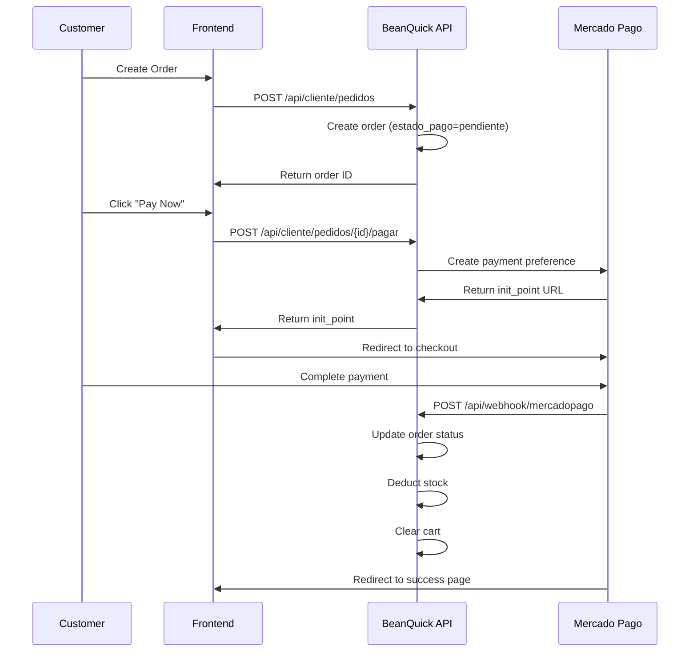

## Overview

BeanQuick integrates with Mercado Pago to process customer payments. The system creates payment preferences, handles webhook notifications, and automatically manages order states and inventory based on payment status.

## Payment Flow

### High-Level Process

1. **Customer creates order** - Order created with `estado_pago='pendiente'`
2. **Customer initiates payment** - System generates Mercado Pago preference
3. **Customer pays** - Redirected to Mercado Pago checkout
4. **Webhook notification** - Mercado Pago notifies BeanQuick backend
5. **Order updated** - System updates payment status and deducts stock
6. **Cart cleared** - Customer's cart emptied on successful payment



## Initiating Payment

### Create Payment Preference

**Endpoint:** `POST /api/cliente/pedidos/{id}/pagar`

```php
// PagoController.php:13
public function pagar($id)
{
    $pedido = Pedido::findOrFail($id);

    // Authorization check
    if ($pedido->user_id !== auth()->id()) {
        return response()->json([
            'message' => 'No autorizado para pagar este pedido.'
        ], 403);
    }

    // Prevent duplicate payments
    if ($pedido->estado_pago === 'aprobado') {
        return response()->json([
            'message' => 'Este pedido ya fue pagado.'
        ], 400);
    }

    // Mark as pending payment
    $pedido->estado_pago = 'pendiente';
    $pedido->save();

    // Configure Mercado Pago
    $token = config('services.mercadopago.access_token');
    MercadoPagoConfig::setAccessToken($token);

    $client = new PreferenceClient();

    // Create payment preference
    $preference = $client->create([
        "items" => [
            [
                "title" => "Pedido BeanQuick #" . $pedido->id,
                "quantity" => 1,
                "unit_price" => (float) $pedido->total
            ]
        ],
        "external_reference" => (string) $pedido->id,
        "notification_url" => env('WEBHOOK_URL'),
        "back_urls" => [
            "success" => env('APP_FRONTEND_URL') . "/pago-exitoso",
            "failure" => env('APP_FRONTEND_URL') . "/pago-fallido",
            "pending" => env('APP_FRONTEND_URL') . "/pago-pendiente"
        ],
        "auto_return" => "approved",
    ]);

    return response()->json([
        "init_point" => $preference->init_point
    ]);
}
```

### Configuration

**Environment Variables:**
```env
MERCADOPAGO_ACCESS_TOKEN=your_access_token
WEBHOOK_URL=https://your-domain.com/api/webhook/mercadopago
APP_FRONTEND_URL=http://localhost:5173
```

**Service Provider:**
```php
// config/services.php
'mercadopago' => [
    'access_token' => env('MERCADOPAGO_ACCESS_TOKEN'),
],
```

### Response

```json
{
  "init_point": "https://www.mercadopago.com.co/checkout/v1/redirect?pref_id=123456789-abc123"
}
```

The frontend redirects the customer to this URL to complete payment.

## Webhook Handling

Mercado Pago sends payment notifications to the webhook endpoint.

**Endpoint:** `POST /api/webhook/mercadopago` (Public, no auth)

### Webhook Implementation

```php
// PagoController.php:61
public function webhook(Request $request)
{
    \Log::info('WEBHOOK RECIBIDO:', $request->all());

    // Check notification type
    $topic = $request->input('type') ?? $request->input('topic');

    if ($topic !== 'payment') {
        return response()->json(['ok' => true]);
    }

    // Extract payment ID
    $paymentId = $request->input('data.id') 
        ?? $request->input('resource') 
        ?? $request->input('id');

    if (!$paymentId) {
        return response()->json(['ok' => true]);
    }

    // Configure Mercado Pago client
    $token = config('services.mercadopago.access_token');
    MercadoPagoConfig::setAccessToken($token);
    $client = new PaymentClient();

    try {
        // Small delay for synchronization
        sleep(2);

        // Fetch payment details
        $payment = $client->get($paymentId);

        \Log::info('PAYMENT COMPLETO:', [
            'status' => $payment->status,
            'external_reference' => $payment->external_reference
        ]);

        if (!$payment->external_reference) {
            return response()->json(['ok' => true]);
        }

        // Find corresponding order
        $pedido = Pedido::with('productos')->find($payment->external_reference);

        if (!$pedido) {
            return response()->json(['ok' => true]);
        }

        // Map Mercado Pago status to internal status
        $nuevoEstado = null;

        switch ($payment->status) {
            case 'approved':
                $nuevoEstado = 'aprobado';
                break;

            case 'pending':
            case 'in_process':
                $nuevoEstado = 'pendiente';
                break;

            case 'rejected':
            case 'cancelled':
                $nuevoEstado = 'rechazado';
                break;

            case 'refunded':
            case 'charged_back':
                $nuevoEstado = 'reembolsado';
                break;

            default:
                return response()->json(['ok' => true]);
        }

        // Only process if status changed (prevent duplicates)
        if ($pedido->estado_pago !== $nuevoEstado) {

            \DB::transaction(function () use ($pedido, $nuevoEstado) {

                $pedido->estado_pago = $nuevoEstado;
                $pedido->save();

                // APPROVED PAYMENT ACTIONS
                if ($nuevoEstado === 'aprobado') {

                    // Update order state
                    $pedido->estado = 'Pagado';
                    $pedido->save();

                    // Deduct stock
                    foreach ($pedido->productos as $producto) {
                        $cantidad = $producto->pivot->cantidad;
                        $producto->decrement('stock', $cantidad);
                    }

                    // Clear customer cart
                    $carrito = \App\Models\Carrito::where('user_id', $pedido->user_id)->first();
                    if ($carrito) {
                        $carrito->productos()->detach();
                    }

                    \Log::info('PEDIDO PAGADO - STOCK DESCONTADO - CARRITO VACIADO', [
                        'pedido_id' => $pedido->id
                    ]);
                }
            });

            \Log::info('PEDIDO ACTUALIZADO', [
                'pedido_id' => $pedido->id,
                'nuevo_estado' => $nuevoEstado
            ]);
        }

    } catch (\Exception $e) {
        \Log::error('ERROR COMPLETO MP:', [
            'message' => $e->getMessage(),
            'payment_id' => $paymentId
        ]);
    }

    return response()->json(['ok' => true]);
}
```

## Payment States

The system maps Mercado Pago payment statuses to internal states:

| Mercado Pago Status | BeanQuick estado_pago | Description |
|---------------------|----------------------|-------------|
| `approved` | `aprobado` | Payment successful |
| `pending` | `pendiente` | Payment processing |
| `in_process` | `pendiente` | Payment in review |
| `rejected` | `rechazado` | Payment declined |
| `cancelled` | `rechazado` | Payment cancelled |
| `refunded` | `reembolsado` | Payment refunded |
| `charged_back` | `reembolsado` | Chargeback issued |

## Automatic Actions on Payment Approval

When `estado_pago` changes to `aprobado`, the system automatically:

### 1. Update Order Status
```php
$pedido->estado = 'Pagado';
$pedido->save();
```

### 2. Deduct Stock
```php
foreach ($pedido->productos as $producto) {
    $cantidad = $producto->pivot->cantidad;
    $producto->decrement('stock', $cantidad);
}
```

### 3. Clear Cart
```php
$carrito = \App\Models\Carrito::where('user_id', $pedido->user_id)->first();
if ($carrito) {
    $carrito->productos()->detach();
}
```

All three actions occur within a database transaction to ensure data consistency.

## Duplicate Prevention

The system prevents duplicate processing of webhook notifications:

```php
if ($pedido->estado_pago !== $nuevoEstado) {
    // Only process if status actually changed
    \DB::transaction(function () use ($pedido, $nuevoEstado) {
        // Update order and stock
    });
}
```

This ensures stock is only deducted once, even if Mercado Pago sends multiple webhook notifications for the same payment.

## Redirect URLs

After payment, customers are redirected based on payment outcome:

**Success:**
```
http://localhost:5173/pago-exitoso
```

**Failure:**
```
http://localhost:5173/pago-fallido
```

**Pending:**
```
http://localhost:5173/pago-pendiente
```

The frontend can display appropriate messages and next steps based on the redirect URL.

## External Reference

The order ID is stored as `external_reference` in Mercado Pago preferences:

```php
"external_reference" => (string) $pedido->id,
```

This links Mercado Pago payments back to BeanQuick orders in webhook notifications.

## Security Considerations

### Webhook Authentication

The webhook endpoint is public (no auth required) because Mercado Pago calls it. However, consider implementing:

1. **IP Whitelisting** - Only accept requests from Mercado Pago IPs
2. **Signature Validation** - Verify request signatures (Mercado Pago provides headers)
3. **HTTPS Only** - Ensure webhook URL uses HTTPS in production

### Payment Validation

```php
// Verify user owns the order
if ($pedido->user_id !== auth()->id()) {
    return response()->json(['message' => 'No autorizado'], 403);
}

// Prevent duplicate payments
if ($pedido->estado_pago === 'aprobado') {
    return response()->json(['message' => 'Ya fue pagado'], 400);
}
```

## Testing Webhooks

### Local Development

Use ngrok or similar tunneling service to expose your local server:

```bash
ngrok http 8000
```

Then set `WEBHOOK_URL` to the ngrok URL:
```env
WEBHOOK_URL=https://abc123.ngrok.io/api/webhook/mercadopago
```

### Test Cards

Mercado Pago provides test cards for different scenarios:

- **Approved:** 5031 7557 3453 0604
- **Rejected:** 5031 4332 1540 6351
- **Pending:** 5031 4332 1540 6351 (with specific amount)

See [Mercado Pago Test Cards](https://www.mercadopago.com/developers/en/docs/checkout-pro/additional-content/test-cards/test-cards)

## Logging

The payment system logs all webhook events:

```php
\Log::info('WEBHOOK RECIBIDO:', $request->all());
\Log::info('PAYMENT COMPLETO:', [
    'status' => $payment->status,
    'external_reference' => $payment->external_reference
]);
\Log::info('PEDIDO PAGADO - STOCK DESCONTADO - CARRITO VACIADO', [
    'pedido_id' => $pedido->id
]);
```

Check `storage/logs/laravel.log` for webhook processing details.

## Error Handling

Webhook errors are logged but don't return error responses:

```php
catch (\Exception $e) {
    \Log::error('ERROR COMPLETO MP:', [
        'message' => $e->getMessage(),
        'payment_id' => $paymentId
    ]);
}

return response()->json(['ok' => true]);
```

This prevents Mercado Pago from retrying indefinitely on temporary errors.

## Complete API Reference

| Method | Endpoint | Auth | Description |
|--------|----------|------|-------------|
| POST | `/api/cliente/pedidos/{id}/pagar` | Customer | Create payment preference |
| POST | `/api/webhook/mercadopago` | None | Receive payment notifications |

## Common Workflows

### Customer Pays for Order
```http
POST /api/cliente/pedidos/15/pagar
Authorization: Bearer {customer_token}
```

**Response:**
```json
{
  "init_point": "https://www.mercadopago.com/checkout/v1/redirect?pref_id=123"
}
```

**Frontend Action:**
```javascript
window.location.href = response.init_point;
```

### Mercado Pago Webhook Notification
```http
POST /api/webhook/mercadopago
Content-Type: application/json

{
  "type": "payment",
  "data": {
    "id": "123456789"
  }
}
```

The system automatically processes this and updates the order.